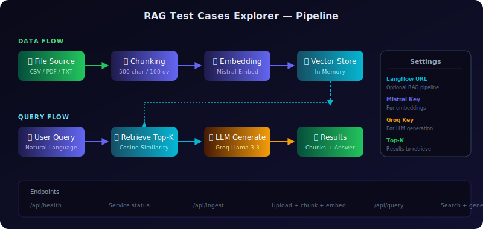

# 🧪 RAG Test Cases Explorer

Semantic search and AI-powered retrieval for test case documents. Upload CSV/PDF/TXT files, ask questions in natural language, and get AI-generated answers with retrieved context chunks.



## Architecture

```
📄 Upload File → 🔪 Chunk → 🧠 Embed (Mistral) → 💾 In-Memory Store
                                                         ↓
❓ User Query → 🔍 Retrieve Top-K → 🤖 Groq LLM → 📊 Results
```

### Optional: Langflow Integration
Point the UI to your Langflow instance and it will route queries through your Langflow RAG pipeline instead.

## Features

- **Upload & Ingest**: CSV, PDF, TXT, JSON, Markdown files
- **Semantic Search**: Natural language queries against test case documents
- **AI Answers**: Groq LLM generates answers from retrieved context
- **Langflow Connect**: Optionally connect to your Langflow RAG pipeline
- **Settings Persistence**: All configuration saved to browser localStorage
- **Flow Diagram**: Visual pipeline displayed on every page load

## Quick Start

### Deploy to Vercel

```bash
cd frontend
npm install -g vercel
vercel --prod
```

Set these env vars in Vercel → Settings → Environment Variables:

| Key | Required | Description |
|-----|----------|-------------|
| `GROQ_API_KEY` | Yes | Groq API key for LLM generation |
| `LLM_MODEL` | No | Default: `llama-3.3-70b-versatile` |
| `TOP_K` | No | Default: `10` |

### Run Locally

```bash
cd frontend
npm install
cp .env.example .env   # add your GROQ_API_KEY
npm run dev             # runs "vercel dev" on http://localhost:3000
```

## API Endpoints

| Endpoint | Method | Description |
|----------|--------|-------------|
| `/api/health` | GET | Service status + ingestion state |
| `/api/ingest` | POST | Upload file (multipart) — chunks, embeds, stores |
| `/api/query` | POST | `{query, top_k}` — retrieves + generates answer |

## Tech Stack

| Layer | Technology |
|-------|-----------|
| Frontend | React 18 (CDN), vanilla CSS |
| API | Python (Vercel serverless) |
| Embeddings | Mistral Embed (`mistral-embed`) |
| LLM | Groq (configurable model) |
| Storage | In-memory (per instance) |
| Deployment | Vercel |

## Connect to Langflow

1. Deploy your Langflow RAG pipeline
2. In the UI, enter your Langflow URL + API token
3. Click "Test Connection" — green dot confirms it's working
4. All queries now route through your Langflow pipeline

## License

MIT
s now route through your Langflow pipeline

## License

MIT
